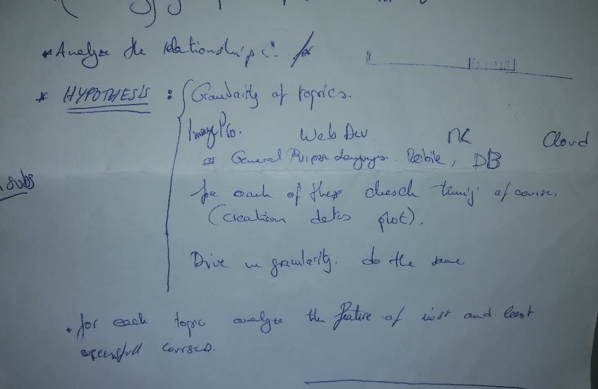

# Project Title

One Paragraph of project description goes here

## Guidelines


 Can we predict success or is it random ?

- dont dive into topic, or content of the course, check predictivity for metadata first
- we can add how many other course treat the same topic ie topic popularity among dataset , for each course


### course content analysis
- Define how to measure success of a course ? ---> normlaize the total number of subs to each topic

- cluster the course topics: using the tags from  stack overflow we can have the popularity of a topic ? think about how to combine all the tags from a course to GET THE POPUARITY OF THE COURSE not the various popularities from 

- categorize the granularity of the courses : is it about webdev, or a specific tool in webdev ?

- Is it one of the first courses in this topic that are succesfull, or look like an existing one ?
- we can match the tags in the syllabus with tags from StacKoverflow

- is there a patern in appearance of courses in the same topic ? from the first course ever in this topic to the hole bundle of course, course in time analysis

### MetaData analysis :

- success measured by : (n subsriber)/(age)

- might try : dividing subscriber by log of age

- Maybe offset by course duration or length, for the same number of subscribers a 40h course is less succesfull than a 2 hour

- calculate a score for a set a successful courses, and say that sucessfulness is attainging 90% of this score.

- correlate the score value with feature of the course : how many lectures when published, how mayny were added

- check rating of the first month or 3 frst months

- HYPOTHESIS: the first moment a course is published is a major determinant of the success

- plot correlation of score and other ffeatures

### Objective : 
- **Set different ranks**
- **compare them then aggregate**
- **run regression**

- (Clustering) the courses by topics (granulatrity, ...)
- for  each topic analyze  the feature of most and least succesfull courses.



Here are the 3 features we discussed that are related to the topic of a course:
indicator variables for what the topic is
how many courses have come in its own topic before it
how popular are the courses in its own topic at the time of its publication

 (Ramtin 22 Novembre) 


## Getting Started

These instructions will get you a copy of the project up and running on your local machine for development and testing purposes. See deployment for notes on how to deploy the project on a live system.

### Prerequisites

What things you need to install the software and how to install them

```
Give examples
```

### Installing

A step by step series of examples that tell you how to get a development env running

Say what the step will be

```
Give the example
```

And repeat

```
until finished
```

End with an example of getting some data out of the system or using it for a little demo

## Running the tests

Explain how to run the automated tests for this system

### Break down into end to end tests

Explain what these tests test and why

```
Give an example
```

### And coding style tests

Explain what these tests test and why

```
Give an example
```

## Deployment

Add additional notes about how to deploy this on a live system

## Built With

* [Dropwizard](http://www.dropwizard.io/1.0.2/docs/) - The web framework used
* [Maven](https://maven.apache.org/) - Dependency Management
* [ROME](https://rometools.github.io/rome/) - Used to generate RSS Feeds

## Contributing

Please read [CONTRIBUTING.md](https://gist.github.com/PurpleBooth/b24679402957c63ec426) for details on our code of conduct, and the process for submitting pull requests to us.

## Versioning

We use [SemVer](http://semver.org/) for versioning. For the versions available, see the [tags on this repository](https://github.com/your/project/tags). 

## Authors

* **Billie Thompson** - *Initial work* - [PurpleBooth](https://github.com/PurpleBooth)

See also the list of [contributors](https://github.com/your/project/contributors) who participated in this project.

## License

This project is licensed under the MIT License - see the [LICENSE.md](LICENSE.md) file for details

## Acknowledgments

* Hat tip to anyone whose code was used
* Inspiration
* etc

